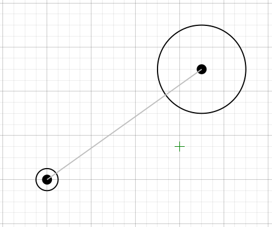
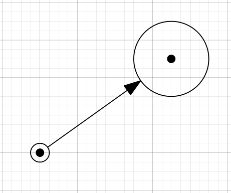
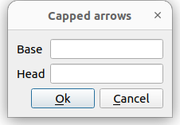

# Capped arrows for Ipe

This ipelet provides a shortcut for drawing arrows between two points in which the arrows do not meet the points at its endpoints.

## Installation

There are two ways to install this ipelet.

1. Run the `install.sh` script.
2. Copy the file `capped_arrows.lua` to your ipelets directory. In Ubuntu this directory is `~/.ipe/ipelets`.

## Usage

1. Select the two points to be joined by an arrow. The first point selected is called the `base` and the second point selected is the `head`.
2. Run the ipelet via the Ipelets menu
3. Enter the length of the arrow to cap at the base and at the head.

